# MauVoyage 🇲🇺

**MauVoyage** is a Flutter-based mobile tourist guide application designed to help visitors explore Mauritius and access useful travel information in one place.

The application combines tourism information with practical travel tools such as weather forecasts, currency conversion, transportation information, multilingual support, translation, emergency information, and accessibility features.

## ✨ Features

* 🗺️ **Tourist Guide**
  Explore information about attractions and places across Mauritius.

* 🌤️ **Weather Forecast**
  Check weather forecasts for different locations using the OpenWeather API.

* 💱 **Currency Converter**
  Convert between currencies to help visitors manage travel expenses.

* 🚌 **Transportation Information**
  Access useful information about transportation options in Mauritius.

* 🌍 **Multilingual Support**
  Support for multiple languages, including English, French, Spanish, and Hindi.

* 🗣️ **Translation**
  Translate text and use text recognition functionality.

* ❤️ **Favourites**
  Save places and content for quick access.

* 🔔 **Notifications & Scheduling**
  Schedule and manage application notifications.

* 🚨 **Emergency Information**
  Access useful emergency-related information while travelling.

* ♿ **Accessibility**
  Includes font-size controls, talk-back support, and accessibility-related settings.

* ⚙️ **Customisable Settings**
  Configure language, font size, notifications, and other application preferences.

## 🛠️ Technologies Used

* **Flutter**
* **Dart**
* **Firebase / Cloud Firestore**
* **OpenWeather API**
* **Google/Firebase Services**
* **Android**
* **iOS**
* **Windows**
* **macOS**
* **Linux**

## 📱 Application Screens

### 🔐 Authentication

<p align="center">
  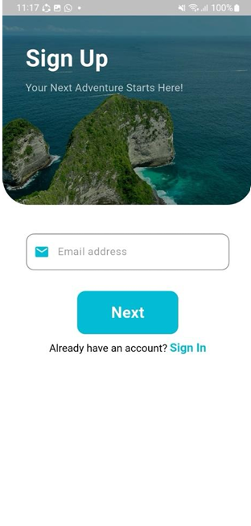
  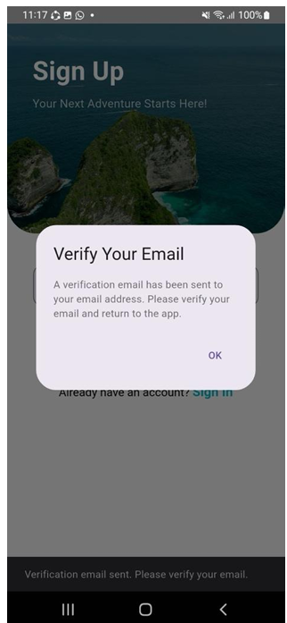
  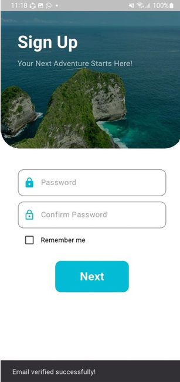
  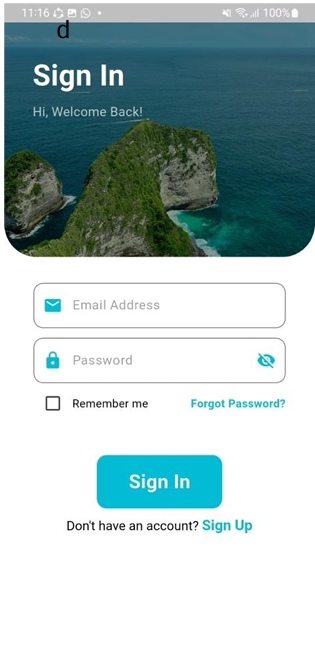
</p>

### 🔑 Password Recovery & Interests

<p align="center">
  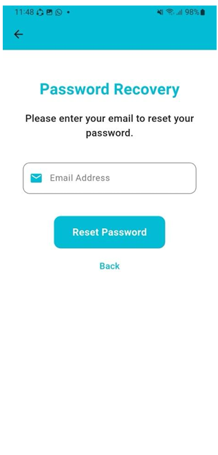
  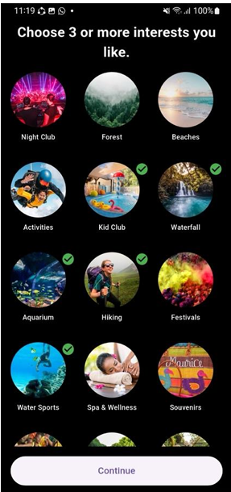
</p>

### 🏠 Home

<p align="center">
  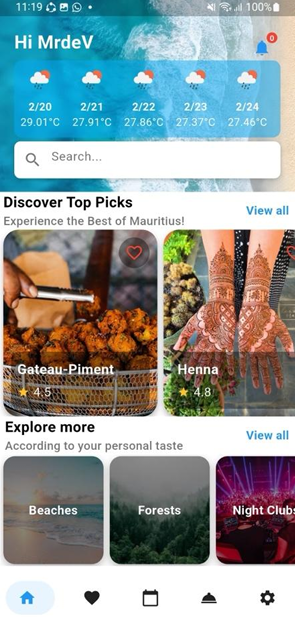
  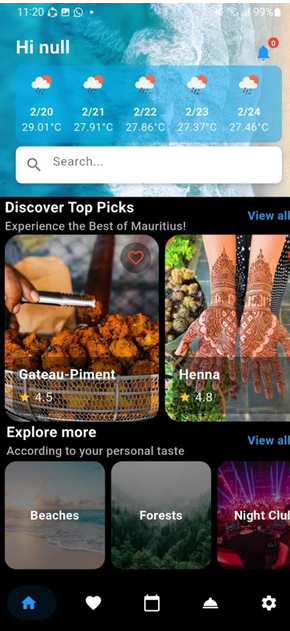
</p>

### 🗺️ Categories

<p align="center">
  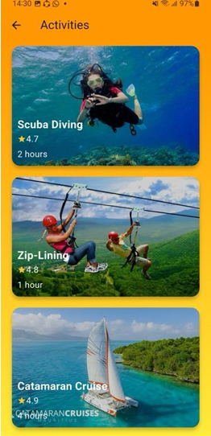
  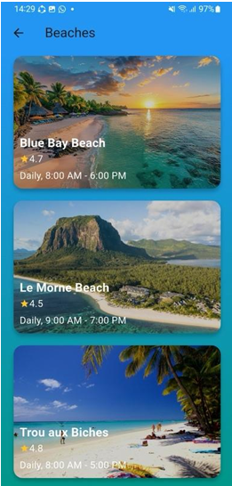
  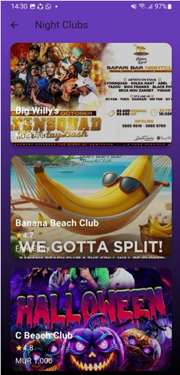
  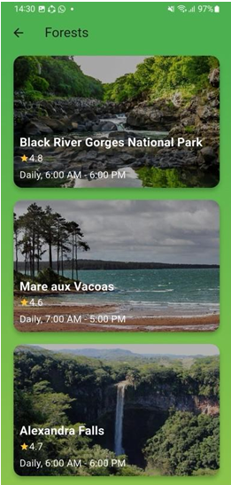
</p>

### 🔍 Search & Favourites

<p align="center">
  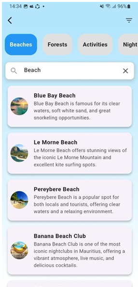
  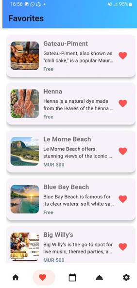
</p>

### 📍 Place Details

<p align="center">
  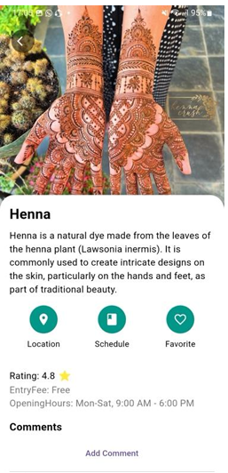
  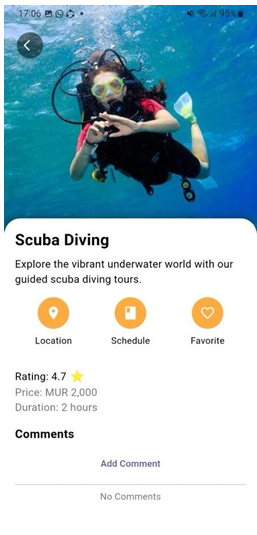
  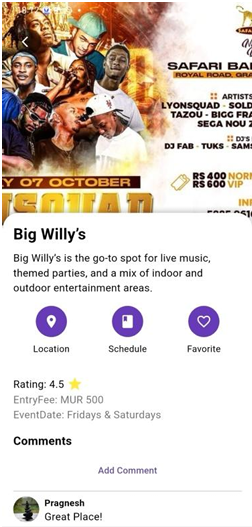
</p>

### 🔔 Scheduling

<p align="center">
  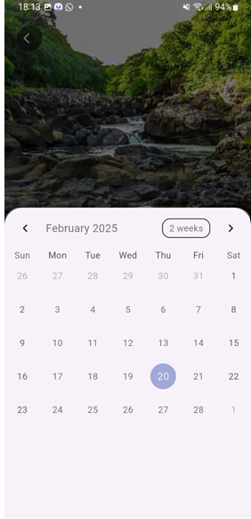
  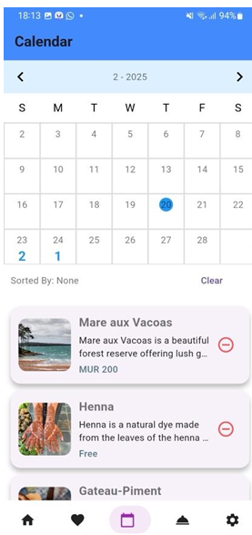
</p>

### 🚨 Emergency

<p align="center">
  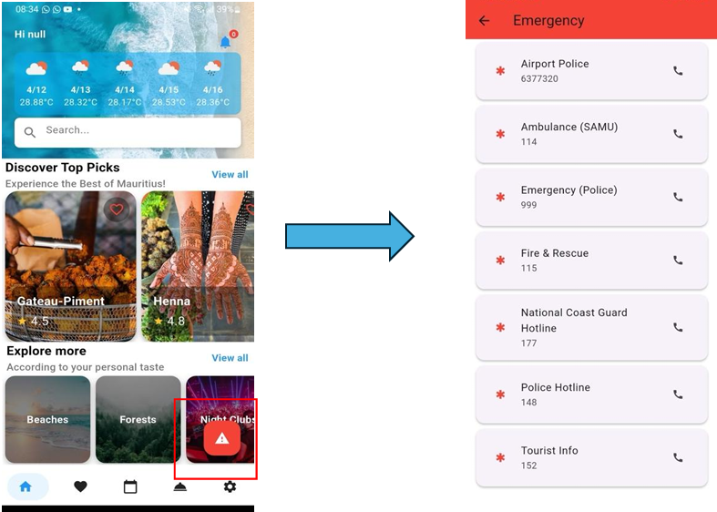
</p>

### 🧰 Services

<p align="center">
  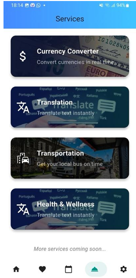
  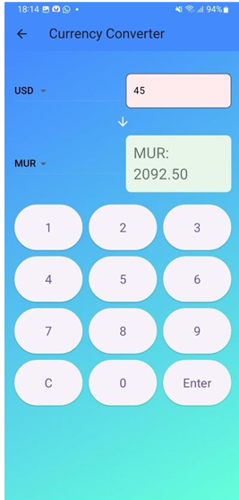
  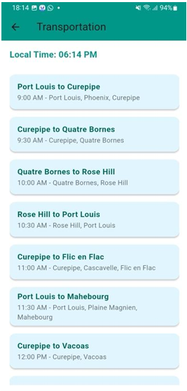
</p>

### ⚙️ Settings

<p align="center">
  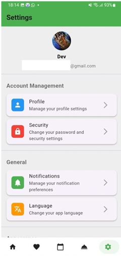
  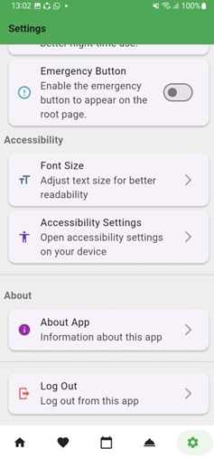
  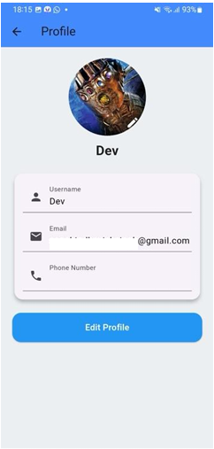
  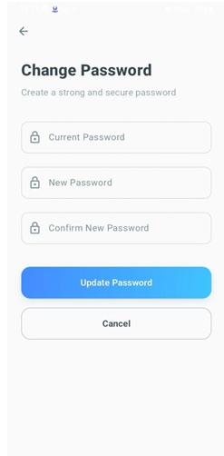
</p>

<p align="center">
  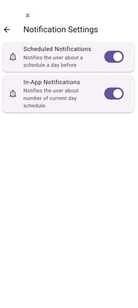
  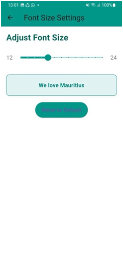
</p>

## 🏗️ Project Structure

```text
lib/
├── acc_management/          # Account management
├── cat_Pages/               # Category-related pages
├── content/                 # Application content and services
├── data_model/              # Data models
├── favourite_manager/       # Favourite management
├── Location/                # Location-related functionality
├── notification_schedule/   # Notification scheduling
├── ui/                      # Application user interface
│   ├── settings/            # Application settings
│   └── translation/         # Translation functionality
├── Applocalizations.dart
└── main.dart
```

## 🚀 Getting Started

### Prerequisites

Before running the project, make sure you have:

* Flutter SDK
* Dart SDK
* Android Studio or another Flutter-compatible IDE
* An Android/iOS emulator or a physical device

Check your Flutter installation:

```bash
flutter doctor
```

### Installation

Clone the repository:

```bash
git clone https://github.com/sathya140803/MauVoyage.git
```

Navigate to the project directory:

```bash
cd MauVoyage
```

Install the dependencies:

```bash
flutter pub get
```

Run the application:

```bash
flutter run
```

## 🔑 API & External Services

MauVoyage integrates with external services including:

* **OpenWeather API** for weather information
* **Firebase / Cloud Firestore** for application data and services
* **Google/Firebase services** for additional application functionality

Some features require valid API credentials to operate.

> API credentials should never be exposed in a public repository. This repository is currently private.

## 🎯 Project Purpose

MauVoyage was developed as a Flutter mobile application focused on improving the travel experience in Mauritius by bringing tourism information and useful travel tools together in a single application.

The project provided practical experience in:

* Flutter application development
* Dart programming
* REST API integration
* Firebase integration
* Cloud Firestore
* Localisation and multilingual applications
* Accessibility
* Mobile UI/UX development
* State and preference management
* Authentication
* Notification scheduling

## 👨‍💻 Developer

**Sathya Moothosawmy**

## 📄 License

This project is intended primarily as a personal/academic portfolio project.
